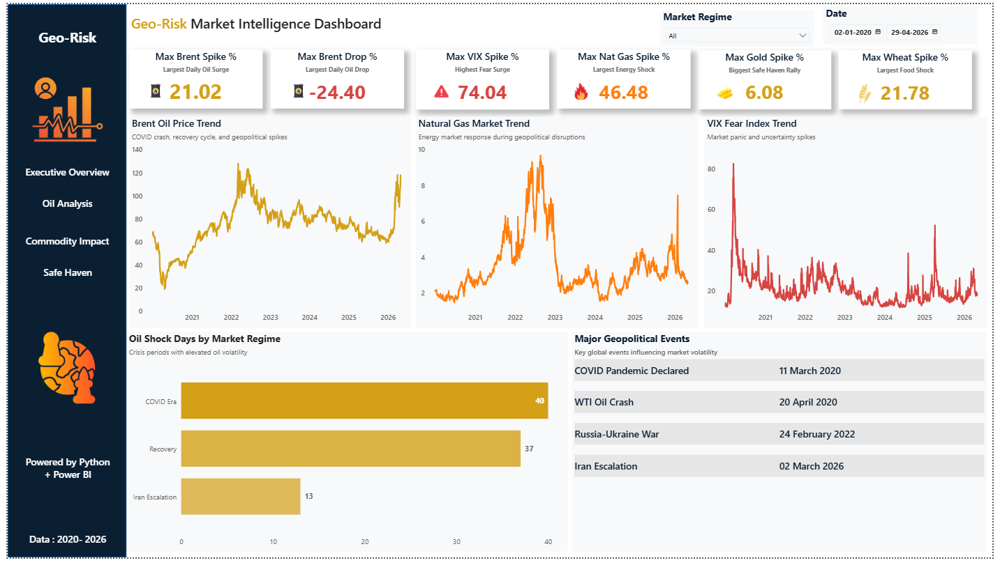
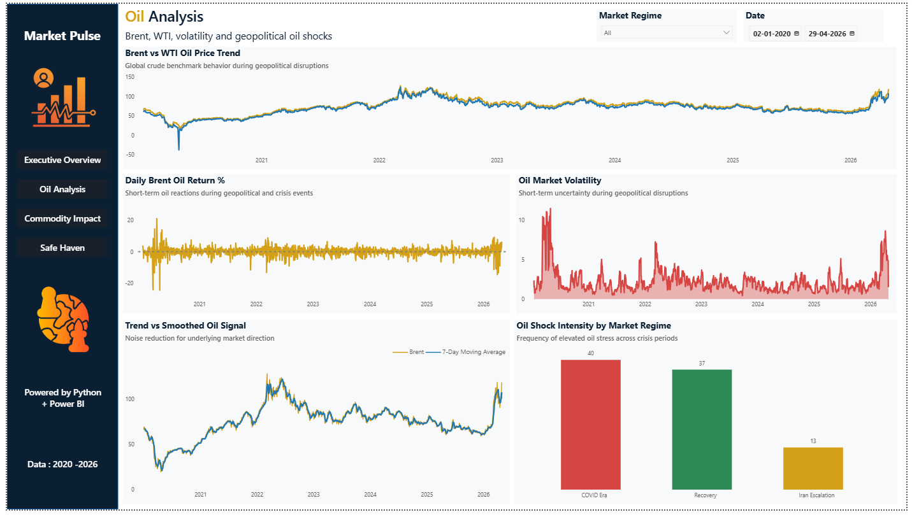
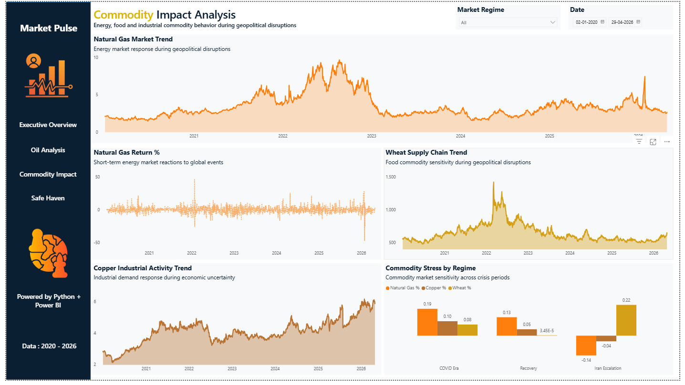
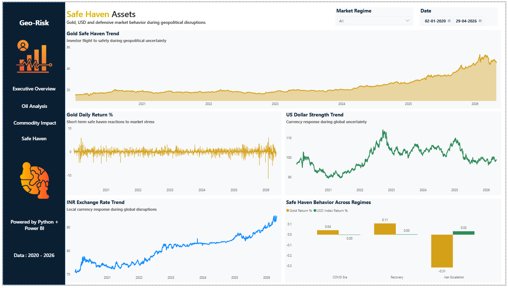

# GeoRisk Market Intelligence Dashboard

A multi-page Power BI dashboard designed to analyze how geopolitical disruptions impact global financial markets, commodities, and safe-haven assets.

The dashboard tracks the market response during major global events including:

- COVID-19 Pandemic
- WTI Oil Crash (2020)
- Russia–Ukraine Conflict
- Iran Escalation (2026)

By combining energy, commodity, volatility, and safe-haven indicators, the dashboard provides a comprehensive view of market behavior during periods of uncertainty.

## Business Objective

To understand how geopolitical shocks influence:

- Oil prices
- Market fear and volatility
- Commodity markets
- Safe-haven assets
- Currency movements

and identify patterns across different market regimes.

## Tools & Technologies
- Python
- Pandas
- Power BI
- DAX
- Yahoo Finance API
- Jupyter Notebook

## Data Sources

Market data collected from Yahoo Finance:

- Brent Crude Oil
- WTI Crude Oil
- VIX Index
- Gold
- USD Index
- INR/USD
- Natural Gas
- Wheat
- Copper

## Data Engineering & Feature Creation

Performed using Python and Pandas:

- Data Preparation
- Data acquisition from Yahoo Finance
- Date alignment and merging
- Missing value handling
- Feature engineering
- Market regime classification
- Derived Metrics
- Daily Returns
- Rolling Volatility
- Moving Averages
- Shock Detection Indicators
- Regime-Based Aggregations

## Dashboard Pages
1. Executive Overview
Provides a high-level summary of market conditions.

Highlights

- Maximum Brent Oil Spike
- Maximum Brent Oil Drop
- Maximum VIX Spike
- Maximum Natural Gas Spike
- Maximum Gold Spike
- Maximum Wheat Spike
- Brent Oil Trend
- Natural Gas Trend
- VIX Trend
- Major Geopolitical Events
- Oil Shock Days by Regime

2. Oil Analysis
Detailed analysis of crude oil behavior.

Highlights

- Brent vs WTI Price Trend
- Daily Brent Returns
- Oil Market Volatility
- Brent Moving Average Analysis
- Oil Shock Intensity by Regime

3. Commodity Impact Analysis
Tracks commodity reactions during geopolitical disruptions.

Highlights

- Natural Gas Trend
- Natural Gas Returns
- Wheat Trend
- Copper Trend
- Commodity Stress by Regime

4. Safe Haven Assets
Analyzes investor flight-to-safety behavior.

Highlights

- Gold Trend
- Gold Daily Returns
- USD Index Trend
- INR Exchange Rate Trend
- Safe Haven Behavior Across Regimes

## Key Insights

# Oil Markets
- Brent crude recorded a maximum daily gain of 21.02% and a maximum decline of -24.40%.
- Oil markets reacted most strongly during major geopolitical and economic disruptions.
- COVID-era volatility produced more shock days than later crisis periods.
  
# Energy Commodities
- Natural Gas showed the largest commodity price swings among the tracked commodities.
- Energy-related assets reacted faster than industrial and agricultural commodities during market stress.
  
# Commodity Impact
- Wheat experienced significant price spikes during supply-chain disruptions and geopolitical tensions.
- Copper movements reflected broader industrial and economic expectations rather than immediate crisis reactions.
  
# Safe-Haven Assets
- Gold generally strengthened during periods of uncertainty and elevated market risk.
- The US Dollar remained resilient during risk-off environments, reinforcing its role as a defensive asset.
  
# Market Regimes
- The COVID period generated the highest concentration of market shocks.
- Recovery periods showed lower volatility and more stable market behavior.
- Iran escalation events produced localized commodity and energy market reactions rather than broad market disruptions.
  
## Recommendations
# Monitor Energy Markets as Early Warning Indicators
- Brent crude oil and Natural Gas consistently showed strong reactions during major geopolitical disruptions. Tracking energy commodities can provide early signals of emerging market stress.

# Use Regime-Based Analysis for Better Context
- Market behavior differed significantly across the COVID, Recovery, and Iran Escalation periods. Segmenting data into market regimes improves interpretation compared to analyzing the entire time series as a single period.

# Track Multiple Asset Classes Simultaneously
- Geopolitical events impacted oil, commodities, currencies, and safe-haven assets differently. A multi-asset monitoring approach provides a more complete view of market risk.

# Include Safe-Haven Indicators in Risk Assessment
- Gold and the US Dollar provided valuable signals during periods of uncertainty. Monitoring defensive assets can help identify shifts in market sentiment.

## Dashboard Preview

### Executive Overview

### Oil Analysis

### Commodity Impact Analysis

### Safe Haven Assets

## Conclusion

This project analyzed the impact of major geopolitical and economic disruptions on global financial markets between 2020 and 2026.

Using Python for data preparation and Power BI for visualization, the dashboard integrated oil markets, commodities, volatility indicators, currencies, and safe-haven assets into a unified analytical framework.

The analysis revealed that market reactions vary across asset classes and crisis periods, with energy commodities showing the strongest immediate responses, safe-haven assets attracting defensive flows during uncertainty, and different commodities exhibiting distinct sensitivity to geopolitical events.

By combining market data with event-based regime analysis, the dashboard provides a structured view of how global shocks propagate through financial and commodity markets.

## Author

Anburaj R

Aspiring Data Analyst | Python | SQL | Power BI | Tableau
